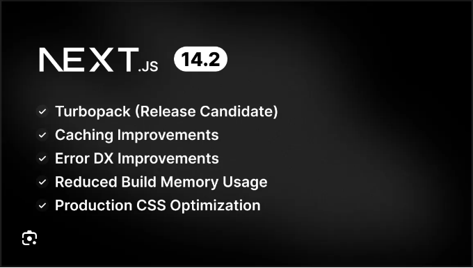

Next.js가 계속 발전하며, 웹 개발 경험을 보완하고 성능 및 신뢰성을 향상시키고 있습니다. 최근에 출시된 Next.js 14.2는 개발자 작업 흐름과 애플리케이션 효율성을 개선하기 위해 다수의 흥미로운 기능을 도입했습니다. Next.js 14.2가 제공하는 주목할 만한 향상 사항을 살펴보겠습니다.

## 개발을 위한 Turbopack

Webpack을 번들링 도구로 대체하는 Turbopack은 Next.js 생태계에서 큰 발전을 나타냅니다. 코드 변경이 발생할 때 거의 즉시 업데이트를 제공하여 개발자 생산성을 크게 향상시키는 것이 목표입니다. 더 스마트한 캐싱과 더 선택적인 재빌드를 통해 이 효율성을 실현하며, 애플리케이션의 한 부분에서 변경 사항이 발생해도 다른 부분의 전체 재빌드가 불필요하게 발생하지 않도록 합니다. 기존 npm 패키지와의 호환성을 유지하면서 Turbopack로 전환하면서 큰 문제를 겪지 않을 것입니다. 또한 다양한 Next.js 예제에서 엄격히 테스트한 결과는 다양한 사용 사례에 대한 견고함과 신뢰성을 입증합니다.

<!-- ui-log 수평형 -->
<ins class="adsbygoogle"
  style="display:block"
  data-ad-client="ca-pub-4877378276818686"
  data-ad-slot="9743150776"
  data-ad-format="auto"
  data-full-width-responsive="true"></ins>
<component is="script">
(adsbygoogle = window.adsbygoogle || []).push({});
</component>

Turbopack을 통해 Next.js는 업데이트가 적용될 때 기다리는 시간을 극적으로 줄여 개발자들이 실제 개발에 더 많은 시간을 투자하고 처리 부담에 덜 주의를 기울일 수 있도록 돕고 있어요. 이 개선은 개발 주기를 가속화할 뿐만 아니라 보다 원활하고 즐겁게 만들어 줍니다.

## 빌드 및 제작 개선사항

Next.js 14.2는 애플리케이션이 빌드되고 제공되는 방식에 중요한 최적화를 도입했습니다. 새로운 tree-shaking 기능은 사용되지 않는 내보내기를 효율적으로 제거하여 번들 크기를 줄이고 로드 시간을 개선합니다. 예를 들어 동일한 패키지에서 다른 모든 컴포넌트를 포함할 필요 없이 단일 컴포넌트를 가져올 때 react-aria-components와 같은 라이브러리에서 번들 크기가 크게 축소되는 것을 확인할 수 있습니다. 게다가 빌드 중 메모리 사용량이 최적화되어 대규모 애플리케이션에서 충돌을 방지하는 크리티컬한 개선이 이루어졌습니다. CSS 청킹에 대한 새로운 접근 방식도 도입되어 다양한 페이지에서 딜레이나 스타일되지 않은 콘텐츠의 번쩍임 없이 일관된 스타일 전달을 보장하고 있습니다.

## 향상된 캐싱 메커니즘

<!-- ui-log 수평형 -->
<ins class="adsbygoogle"
  style="display:block"
  data-ad-client="ca-pub-4877378276818686"
  data-ad-slot="9743150776"
  data-ad-format="auto"
  data-full-width-responsive="true"></ins>
<component is="script">
(adsbygoogle = window.adsbygoogle || []).push({});
</component>

Caching 전략은 클라이언트 측 라우터 캐시를 위한 staleTimes 구성을 통해 상당히 업그레이드되었습니다. 이 기능을 사용하면 캐시된 페이지의 유효 기간이 만료되기 전에 "stale(무효)"로 간주되는 방법을 개발자가 지정할 수 있어서 콘텐츠 신선도와 성능을 더 잘 제어할 수 있습니다.

## 개발자 경험 향상

Next.js 14.2는 오류 메시지 및 디버깅 도구 개선에 초점을 맞추어 개발자 경험을 향상시키고 있습니다. 새로운 오류 오버레이는 밝은 테마와 어두운 테마를 모두 지원하여, 개발자가 선호하는 시각적 환경에서 문제를 해결하기 쉬워졌습니다.

<!-- ui-log 수평형 -->
<ins class="adsbygoogle"
  style="display:block"
  data-ad-client="ca-pub-4877378276818686"
  data-ad-slot="9743150776"
  data-ad-format="auto"
  data-full-width-responsive="true"></ins>
<component is="script">
(adsbygoogle = window.adsbygoogle || []).push({});
</component>

## 앞으로 기대할 점

앞으로, Next.js 팀은 React 19의 통합을 준비 중이며, 캐싱 및 빌드 효율성을 더욱 향상시킬 것입니다. 이러한 준비는 Next.js를 현대 웹 개발 기술의 전선에 유지하기 위한 약속을 나타냅니다.

## 결론

Next.js 14.2의 개선 사항은 프레임워크를 더욱 효율적이고 개발자 친화적으로 만드는 데 초점이 맞춰져 있습니다. 더 빠른 빌드 시간부터 개선된 캐싱 메커니즘까지, 이러한 업데이트는 웹 응용 프로그램을 최적화하려는 개발자들에게 유익합니다.

<!-- ui-log 수평형 -->
<ins class="adsbygoogle"
  style="display:block"
  data-ad-client="ca-pub-4877378276818686"
  data-ad-slot="9743150776"
  data-ad-format="auto"
  data-full-width-responsive="true"></ins>
<component is="script">
(adsbygoogle = window.adsbygoogle || []).push({});
</component>

위의 업데이트에 대해 자세히 알아보시고 프로젝트를 위해 Next.js 14.2로 업그레이드를 고려해보시기를 권장합니다. 더 많은 세부 정보를 보려면 공식 Next.js 블로그를 방문해주세요.

# 평문으로 말해보자 🚀

In Plain English 커뮤니티의 일원이 되어 주셔서 감사합니다! 떠나시기 전에:

- 작성자를 박수치고 팔로우하는 것을 잊지 마세요 ️👏️️
- 팔로우: X | LinkedIn | YouTube | Discord | 뉴스레터
- 다른 플랫폼 방문하기: Stackademic | CoFeed | Venture | Cubed
- PlainEnglish.io에서 더 많은 컨텐츠를 확인하세요