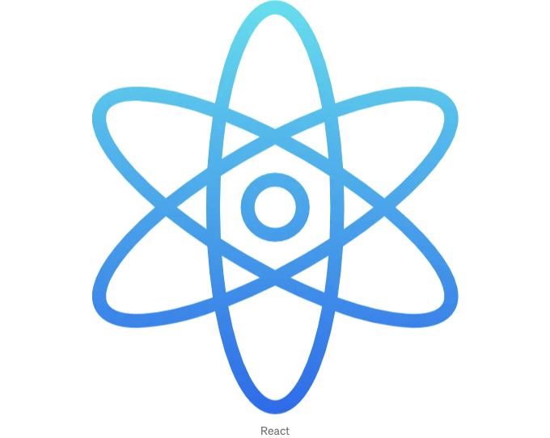

리액트에서는 컴포넌트의 다양한 동작을 처리하기 위한 여러 종류의 내장 훅이 있습니다. 여기에는 일반적으로 사용되는 내장 훅 목록이 있습니다.

## 1. 상태 훅(State Hooks):

- `useState`: 이는 가장 일반적으로 사용되는 리액트 훅입니다. 함수형 컴포넌트가 상태 변수를 가질 수 있게 합니다. 초기 상태 값을 인수로 받고, 현재 상태 값을 나타내는 배열과 해당 상태를 업데이트하는 함수를 반환합니다.

<!-- ui-log 수평형 -->
<ins class="adsbygoogle"
  style="display:block"
  data-ad-client="ca-pub-4877378276818686"
  data-ad-slot="9743150776"
  data-ad-format="auto"
  data-full-width-responsive="true"></ins>
<component is="script">
(adsbygoogle = window.adsbygoogle || []).push({});
</component>

```js
import React, { useState } from 'react';

function Counter() {
  const [count, setCount] = useState(0);

  const increment = () => {
    setCount(count + 1);
  };

  return (
    <div>
      <p>Count: {count}</p>
      <button onClick={increment}>Increment</button>
    </div>
  );
}
```

- 'useReducer': 'useState' 대신 복잡한 상태 로직을 관리하거나 다음 상태가 이전 상태에 따라 결정되는 경우에 대안을 제공합니다.

```js
import React, { useReducer } from 'react';

const initialState = { count: 0 };

function reducer(state, action) {
  switch (action.type) {
    case 'increment':
      return { count: state.count + 1 };
    case 'decrement':
      return { count: state.count - 1 };
    case 'reset':
      return initialState;
    default:
      throw new Error('지원되지 않는 액션 타입입니다.');
  }
}

function Counter() {
  const [state, dispatch] = useReducer(reducer, initialState);

  const increment = () => {
    dispatch({ type: 'increment' });
  };

  const decrement = () => {
    dispatch({ type: 'decrement' });
  };

  const reset = () => {
    dispatch({ type: 'reset' });
  };

  return (
    <div>
      <p>Count: {state.count}</p>
      <button onClick={increment}>Increment</button>
      <button onClick={decrement}>Decrement</button>
      <button onClick={reset}>Reset</button>
    </div>
  );
}
```

## 2. Effect Hooks:```  

<!-- ui-log 수평형 -->
<ins class="adsbygoogle"
  style="display:block"
  data-ad-client="ca-pub-4877378276818686"
  data-ad-slot="9743150776"
  data-ad-format="auto"
  data-full-width-responsive="true"></ins>
<component is="script">
(adsbygoogle = window.adsbygoogle || []).push({});
</component>

- ‘useEffect’: 컴포넌트가 렌더링된 후에 데이터를 가져오거나 구독하거나 DOM 조작과 같은 사이드 이펙트를 수행할 수 있게 합니다.

```js
import React, { useState, useEffect } from 'react';

function Example() {
  const [data, setData] = useState(null);

  useEffect(() => {
    // 이 효과는 컴포넌트가 렌더링된 후에 실행됩니다

    // 비동기 데이터 가져오기 수행
    fetchData()
      .then((result) => {
        setData(result);
      })
      .catch((error) => {
        console.error('데이터 가져오는 중 오류 발생:', error);
      });

    // 효과 청소
    return () => {
      // 여기서 필요한 정리 수행
      // 선택적이지만 메모리 누수를 방지하려면 중요합니다
    };
  }, []); // 의존성 배열이 비어 있으므로 효과는 컴포넌트가 마운트될 때 한 번만 실행됩니다

  return <div>{data ? <p>데이터: {data}</p> : <p>데이터 불러오는 중...</p>}</div>;
}

export default Example;
```

- ‘useLayoutEffect’: ‘useEffect’와 유사하지만 돔 변경이 적용된 후 동기적으로 실행되며, 레이아웃 측정 또는 동기적 업데이트가 필요한 돔 조작에 유용합니다.

```js
import React, { useState, useLayoutEffect } from 'react';

function Example() {
  const [width, setWidth] = useState(0);

  useLayoutEffect(() => {
    // 이 효과는 돔 변경이 모두 적용된 후 동기적으로 실행되지만
    // 브라우저가 그리기 전에 실행됩니다

    const updateWidth = () => {
      const newWidth = document.documentElement.clientWidth;
      setWidth(newWidth);
    };

    // 창 크기 조절 이벤트 리스너 추가
    window.addEventListener('resize', updateWidth);

    // 초기 너비 업데이트
    updateWidth();

    // 효과 청소
    return () => {
      // 이벤트 리스너 제거
      window.removeEventListener('resize', updateWidth);
    };
  }, []); // 의존성 배열이 비어 있으므로 효과는 컴포넌트가 마운트될 때 한 번만 실행됩니다

  return <div>창 너비: {width}px</div>;
}

export default Example;
```  

<!-- ui-log 수평형 -->
<ins class="adsbygoogle"
  style="display:block"
  data-ad-client="ca-pub-4877378276818686"
  data-ad-slot="9743150776"
  data-ad-format="auto"
  data-full-width-responsive="true"></ins>
<component is="script">
(adsbygoogle = window.adsbygoogle || []).push({});
</component>

- ‘useEffectOnce’: 컴포넌트가 마운트될 때 한 번만 효과를 실행하는 사용자 정의 훅입니다.

```js
import React, { useEffect } from 'react';

function useEffectOnce(effect) {
  useEffect(effect, []);
}

// 사용 예시:
function Example() {
  useEffectOnce(() => {
    // 이 효과는 컴포넌트가 마운트될 때 한 번만 실행됩니다
    console.log('효과가 한 번만 실행되었습니다');
  });

  return <div>예제 컴포넌트</div>;
}

export default Example;
```

## 3. 컨텍스트 훅:

- ‘useContext’: React의 이 훅은 React 컨텍스트로부터 값을 소비하는 데 사용됩니다. 이를 통해 함수형 컴포넌트가 컴포넌트 트리 상단에서 제공된 값에 접근할 수 있도록 하며 프롭 드릴링이 필요하지 않습니다.

<!-- ui-log 수평형 -->
<ins class="adsbygoogle"
  style="display:block"
  data-ad-client="ca-pub-4877378276818686"
  data-ad-slot="9743150776"
  data-ad-format="auto"
  data-full-width-responsive="true"></ins>
<component is="script">
(adsbygoogle = window.adsbygoogle || []).push({});
</component>

- 문맥 만들기

```js
// createContext.js
import React from 'react';

// 새로운 컨텍스트 생성
const MyContext = React.createContext();

export default MyContext;
```

2. Context Provider를 사용하여 값 제공

```js
import React from 'react';
import MyContext from './createContext';

function App() {
  const value = '안녕, 컨텍스트!';

  return (
    <MyContext.Provider value={value}>
      <ChildComponent />
    </MyContext.Provider>
  );
}
```

<!-- ui-log 수평형 -->
<ins class="adsbygoogle"
  style="display:block"
  data-ad-client="ca-pub-4877378276818686"
  data-ad-slot="9743150776"
  data-ad-format="auto"
  data-full-width-responsive="true"></ins>
<component is="script">
(adsbygoogle = window.adsbygoogle || []).push({});
</component>

3. 'useContext'을 사용하여 컨텍스트 값을 사용하기

```js
import React, { useContext } from 'react';
import MyContext from './createContext';

function ChildComponent() {
  const contextValue = useContext(MyContext);

  return <div>{contextValue}</div>;
}
```

## 4. Ref Hooks:

- 'useRef': 렌더링 사이에 지속되는 값이나 DOM 요소에 대한 가변 참조를 생성하는 방법을 제공합니다. 주로 DOM 요소에 접근하거나 조작하는 데 사용됩니다.

<!-- ui-log 수평형 -->
<ins class="adsbygoogle"
  style="display:block"
  data-ad-client="ca-pub-4877378276818686"
  data-ad-slot="9743150776"
  data-ad-format="auto"
  data-full-width-responsive="true"></ins>
<component is="script">
(adsbygoogle = window.adsbygoogle || []).push({});
</component>

```js
import React, { useRef } from 'react';

function Example() {
  const inputRef = useRef(null);

  const handleClick = () => {
    inputRef.current.focus();
  };

  return (
    <div>
      <input type="text" ref={inputRef} />
      <button onClick={handleClick}>텍스트 입력란에 포커스 주기</button>
    </div>
  );
}

export default Example;
```

## 5. Callback Hooks:

- ‘useCallback’: 콜백 함수를 메모이제이션하여, 의존성이 변경되지 않는 한 매 렌더링마다 다시 생성되지 않도록 합니다. 자식 컴포넌트의 불필요한 다시 렌더링을 피하고 성능을 최적화하는 데 유용합니다.

```js
import React, { useState, useCallback } from 'react';

function Example() {
  const [count, setCount] = useState(0);

  const increment = useCallback(() => {
    setCount(count + 1);
  }, [count]);

  return (
    <div>
      <p>숫자: {count}</p>
      <button onClick={increment}>증가</button>
    </div>
  );
}

export default Example;
```

<!-- ui-log 수평형 -->
<ins class="adsbygoogle"
  style="display:block"
  data-ad-client="ca-pub-4877378276818686"
  data-ad-slot="9743150776"
  data-ad-format="auto"
  data-full-width-responsive="true"></ins>
<component is="script">
(adsbygoogle = window.adsbygoogle || []).push({});
</component>

- ‘useMemo’: 이것은 의존성이 변경되지 않으면 매 렌더링마다 다시 계산되지 않도록 값을 메모화합니다. 비싼 계산이나 복잡한 데이터 변환을 최적화하는 데 유용합니다.

```js
import React, { useState, useMemo } from 'react';

function Example() {
  const [count, setCount] = useState(0);

  const doubleCount = useMemo(() => {
    return count * 2;
  }, [count]);

  return (
    <div>
      <p>Count: {count}</p>
      <p>Double Count: {doubleCount}</p>
      <button onClick={() => setCount(count + 1)}>Increment</button>
    </div>
  );
}

export default Example;
```

## 6. 레이아웃 후크:

- ‘useDimensions’: 이것은 요소의 차원을 측정합니다.
- ‘useWindowSize’: 현재 창 크기를 가져옵니다.

<!-- ui-log 수평형 -->
<ins class="adsbygoogle"
  style="display:block"
  data-ad-client="ca-pub-4877378276818686"
  data-ad-slot="9743150776"
  data-ad-format="auto"
  data-full-width-responsive="true"></ins>
<component is="script">
(adsbygoogle = window.adsbygoogle || []).push({});
</component>

## 7. Form Hooks:

- ‘useForm’: 폼 상태와 유효성 검사를 제공합니다.

## 8. Animation Hooks:

- ‘useSprings’: React Spring을 사용하여 애니메이션을 위한 애니메이션 값을 생성합니다.

<!-- ui-log 수평형 -->
<ins class="adsbygoogle"
  style="display:block"
  data-ad-client="ca-pub-4877378276818686"
  data-ad-slot="9743150776"
  data-ad-format="auto"
  data-full-width-responsive="true"></ins>
<component is="script">
(adsbygoogle = window.adsbygoogle || []).push({});
</component>

## 9. 커스텀 훅:

- 재사용 가능한 로직과 상태 지향 행동을 캡슐화하기 위해 커스텀 훅을 만들 수 있습니다. 커스텀 훅은 다른 훅을 활용할 수 있도록 이름이 "use"로 시작하는 규칙을 따라야 합니다.