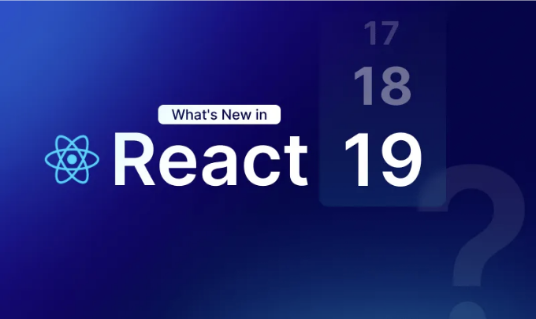

리액트의 마지막 새로운 버전은 2022년 6월 14일에 나온 18.2.0 버전이었어요. 웹사이트와 앱을 만드는 세계에서 리액트는 정말 인기 있는 기술이에요. 하지만 새로운 업데이트를 받은 게 오래되어서 리액트 커뮤니티의 중요 인물들이 불만을 토로했어요.

이제 많은 사람들이 화를 내자, 리액트는 드디어 새 버전을 발표했어요.

리액트 팀은 새로운 것을 내놓는 데 왜 그토록 오랜 시간이 걸렸는지 설명했어요. 그들은 작업 중인 기능들이 서로 잘 어울리는지 확인하기 위해 많은 시간이 필요했다고 말했어요. 그들은 이러한 기능들을 차근차근 'Canary' 버전에 추가했는데, 이는 마치 테스트 버전 같은 존재에요.

<!-- ui-log 수평형 -->
<ins class="adsbygoogle"
  style="display:block"
  data-ad-client="ca-pub-4877378276818686"
  data-ad-slot="9743150776"
  data-ad-format="auto"
  data-full-width-responsive="true"></ins>
<component is="script">
(adsbygoogle = window.adsbygoogle || []).push({});
</component>

약 2년 동안 새 버전을 공식으로 출시하지 않은 React는 캐너리 버전을 업데이트하여 새로운 후크와 디렉티브와 같은 멋진 기능을 추가했습니다. 이러한 업데이트로 React가 더욱 향상되어, 특히 Next.js 및 Remix와 같은 풀 스택 프레임워크를 만드는 데 도움이 되었습니다.

React 팀은 다음 주요 업데이트의 버전 번호를 19.0.0로 지정했습니다. 그래서, 흥미로운 일들이 기다리고 있습니다!

React v19의 새로운 기능

## 1. 리액트 컴파일러

<!-- ui-log 수평형 -->
<ins class="adsbygoogle"
  style="display:block"
  data-ad-client="ca-pub-4877378276818686"
  data-ad-slot="9743150776"
  data-ad-format="auto"
  data-full-width-responsive="true"></ins>
<component is="script">
(adsbygoogle = window.adsbygoogle || []).push({});
</component>

React Compiler가 Instagram.com에서 실제로 사용되고 있는 React의 기능적인 큰 발전을 이루었습니다. 이제 이는 더 이상 연구 프로젝트가 아니라 운영 중인 서비스로 구동되고 있습니다. 최적화된 컴파일러를 구현함으로써, 상태 변화 시 과도한 다시 렌더링 문제를 해결합니다.

이 컴파일러는 사람의 메모이제이션과 대비하여 상태 변경 시 특정 UI 요소를 자동으로 다시 렌더링함으로써 코드 블로트를 제거합니다. JavaScript 및 React 가이드라인을 준수하여 성능과 안정성을 보장합니다.

Strict Mode 및 React의 ESLint 플러그인과 같은 도구를 사용하여 개발자들은 코드를 유효성 검사할 수 있습니다. 오픈 소스로의 릴리스를 계획하고 있는 이 컴파일러는 현재 Instagram.com에서 운영 중이며, Metasurfaces 전반에 걸쳐 추가 통합을 준비 중입니다.

## 2. 작업들

<!-- ui-log 수평형 -->
<ins class="adsbygoogle"
  style="display:block"
  data-ad-client="ca-pub-4877378276818686"
  data-ad-slot="9743150776"
  data-ad-format="auto"
  data-full-width-responsive="true"></ins>
<component is="script">
(adsbygoogle = window.adsbygoogle || []).push({});
</component>

이 버전에서 액션은 게임 체인저입니다. 액션을 사용하여 DOM 요소에 함수를 전달할 수 있습니다. 예를들어,

```js
<form action={search}>
  <input name="query" />
  <button type="submit">Search</button>
</form>
```

액션 함수는 동기적 또는 비동기적으로 작동할 수 있습니다. 서버에서는 `use server` 지시문을 사용하여 정의할 수도 있고, 클라이언트 측에서는 일반 JavaScript를 사용하여 정의할 수도 있습니다. 액션을 사용하면 React가 데이터 제출 라이프 사이클을 처리하고 useFormStatus 및 useFormState 같은 후크를 제공하여 활성화된 양식 액션의 상태와 응답을 가져올 수 있습니다. 액션은 기본적으로 전환 내에서 제출되며, 현재 페이지의 상호 작용성을 유지하면서 처리됩니다. 전환 내에서의 Async/await를 통해 async 함수를 사용하고 보류 중인 사용자 인터페이스 (UI)를 표시할 수 있습니다. isPending 상태는 데이터 가져오기와 같은 비동기 요청 처리 중에 진행 중인 처리를 나타내기 위해 사용됩니다.

# 3. 지시문: use client 및 server

<!-- ui-log 수평형 -->
<ins class="adsbygoogle"
  style="display:block"
  data-ad-client="ca-pub-4877378276818686"
  data-ad-slot="9743150776"
  data-ad-format="auto"
  data-full-width-responsive="true"></ins>
<component is="script">
(adsbygoogle = window.adsbygoogle || []).push({});
</component>

한동안 Canary 버전에 포함된 후, 사용자 및 서버 지시문은 v19부터 안정 버전의 일부로 지원될 예정입니다.

Next.js가 이 두 가지 지시문을 제품으로 사용할 때, React 팀은 종종 Next.js가 일정보다 먼저 불안정한 기능을 사용하도록 허용하고 React 생태계에 해를 끼친다는 이유로 커뮤니티에서 비판을 받았습니다.

풀 스택 프레임워크 대신 React를 활용하는 경우, 서버 측과 프론트엔드 콘텍스트 사이의 "분할 지점"은 사용자 및 서버 명령을 사용하여 나타낼 수 있습니다.

패키지 도구는 사용자를 이용하여 `script` 태그를 작성하고, 서버를 이용하여 POST 엔드포인트를 생성하도록 지시받습니다. 이러한 지시문 덕분에 개발자는 서버 측 및 클라이언트 측 코드를 같은 파일에 작성할 수 있습니다.

<!-- ui-log 수평형 -->
<ins class="adsbygoogle"
  style="display:block"
  data-ad-client="ca-pub-4877378276818686"
  data-ad-slot="9743150776"
  data-ad-format="auto"
  data-full-width-responsive="true"></ins>
<component is="script">
(adsbygoogle = window.adsbygoogle || []).push({});
</component>

# 4. useOptimistic를 사용한 낙관적 업데이트

v19에서 새로운 훅 useOptimistic은 안정 버전으로 태깅될 것으로 예상됩니다. 네트워크 요청과 같은 비동기 작업 중에 useOptimistic를 사용하면 낙관적인 방식으로 사용자 인터페이스를 새로 고칠 수 있습니다.

비동기 작업 중에 상태의 레플리카를 반환하며, 현재 상태와 업데이트 함수를 입력으로 받습니다. 작업이 완료될 때까지 새로운 낙관적 상태를 반환하는 함수를 제공해야 합니다.

```js
const [optimisticState, addOptimistic] = useOptimistic(state, updateFn);

// 또는

const [optimisticState, addOptimistic] = useOptimistic(state,
// updateFn

(currentState, optimisticValue) => {

// 낙관적 값으로 새 상태를 병합하고 반환

}

);
```

<!-- ui-log 수평형 -->
<ins class="adsbygoogle"
  style="display:block"
  data-ad-client="ca-pub-4877378276818686"
  data-ad-slot="9743150776"
  data-ad-format="auto"
  data-full-width-responsive="true"></ins>
<component is="script">
(adsbygoogle = window.adsbygoogle || []).push({});
</component>

# 5. 문서 메타데이터

"제목," "메타 태그," 그리고 "설명"과 같은 구성 요소는 접근성과 SEO 최적화에 모두 중요합니다. 싱글 페이지 애플리케이션이 흔해져서 React에서 여러 루트를 횡단해서 이러한 요소들을 관리하는 것은 번거로울 수 있습니다.

현재 개발자들은 주로 react-helmet과 같은 패키지를 사용하거나 라우트 변경을 관리하고 메타데이터를 적절히 업데이트하기 위해 사용자 정의 코드를 작성합니다. 특히 메타 태그와 같은 SEO에 민감한 측면과 함께 작업할 때는 이것이 지루하고 오류가 발생하기 쉬운 프로세스입니다.

# 6. 에셋 로딩

<!-- ui-log 수평형 -->
<ins class="adsbygoogle"
  style="display:block"
  data-ad-client="ca-pub-4877378276818686"
  data-ad-slot="9743150776"
  data-ad-format="auto"
  data-full-width-responsive="true"></ins>
<component is="script">
(adsbygoogle = window.adsbygoogle || []).push({});
</component>

리액트에서 애플리케이션이 이미지와 기타 자산 파일을 사용할 때에는 특히 로딩 속도와 부드러운 표시를 신중하게 제어해야 합니다.

일반적으로 스타일시트, 폰트 및 그래픽 요소는 뷰 이후에 렌더링됩니다. 이는 스타일이 적용된 뷰와 스타일이 적용되지 않은 콘텐츠 사이에 깜박임이 발생하거나 스타일이 적용되지 않은 콘텐츠가 번쩍이게 할 수 있습니다.

이 문제를 완화하고 뷰가 모든 것이 로드된 후에만 표시되도록 하기 위해 개발자는 종종 자체 코드를 사용하여 이러한 자산이 준비됐는지 확인합니다.

리액트 19에서 사용자가 현재 페이지를 탐색하는 경우, 사진 및 기타 파일이 백그라운드에서 로드됩니다. 이 향상은 빠른 페이지 로딩과 대기 시간 단축을 용이하게 할 것으로 기대됩니다.

<!-- ui-log 수평형 -->
<ins class="adsbygoogle"
  style="display:block"
  data-ad-client="ca-pub-4877378276818686"
  data-ad-slot="9743150776"
  data-ad-format="auto"
  data-full-width-responsive="true"></ins>
<component is="script">
(adsbygoogle = window.adsbygoogle || []).push({});
</component>

또한, React는 폰트, 스타일시트 및 스크립트와 같은 에셋을 로딩하기 위한 라이프사이클 Suspense를 제공하고 있습니다. 이 기능을 통해 "스타일이 적용되지 않은" 깜빡임이 없어지며, React가 정보가 표시 준비가 된 시점을 감지할 수 있습니다.

사용자가 리소스가 로드되고 초기화되는 시점을 더 잘 제어할 수 있도록, preload 및 preinit과 같은 새로운 자원 로딩 API가 소개되었습니다.

React 19은 대기 시간을 최소화하고 사용자가 콘텐츠와 상호 작용할 수 있도록 보장하기 위해 에셋을 백그라운드에서 비동기적으로 로드하도록 합니다.

# React 19으로 업데이트하기

<!-- ui-log 수평형 -->
<ins class="adsbygoogle"
  style="display:block"
  data-ad-client="ca-pub-4877378276818686"
  data-ad-slot="9743150776"
  data-ad-format="auto"
  data-full-width-responsive="true"></ins>
<component is="script">
(adsbygoogle = window.adsbygoogle || []).push({});
</component>

현재 애플리케이션을 React 19로 전환하려면 다음 가이드라인을 준수하세요:

- 애플리케이션 평가: 수정 사항이 기존 시스템에 어떤 영향을 미칠지 파악하세요.
- 변경 사항 점진적으로 구현: 기능에 중단을 방지하기 위해 조금씩 조정 사항을 도입하세요.
- Codemods 활용: codemods와 같은 도구를 활용하여 업데이트를 자동화하세요.
- 철저한 테스트 수행: 확인을 위해 철저한 테스트를 수행하세요.
- 엄격 모드 활성화: 잠재적 문제를 빠르게 파악하기 위해 엄격 모드를 활성화하세요.

현재 공식적인 React 19 릴리스 날짜는 아직 발표되지 않았습니다. 그러나 React 팀은 올해 언젠가 릴리스될 예정이라고 언급했습니다.

# React 19 및 그 기능에 관한 주요 포인트:

<!-- ui-log 수평형 -->
<ins class="adsbygoogle"
  style="display:block"
  data-ad-client="ca-pub-4877378276818686"
  data-ad-slot="9743150776"
  data-ad-format="auto"
  data-full-width-responsive="true"></ins>
<component is="script">
(adsbygoogle = window.adsbygoogle || []).push({});
</component>

- React 19는 현재 개발 중이며, 6월이나 7월에 공식 릴리스가 예정되어 있습니다.
- React 19는 새로운 웹 플랫폼 API를 지원할 예정이며, replace text를 포함합니다.
- 성능 및 개발자 경험을 향상시키는 기능에 중점을 두어 "점진적 향상"을 강조합니다.
- 대부분의 React 애플리케이션에 대한 업그레이드 프로세스는 비교적 원활할 것으로 예상되지만, 일부 잠재적으로 중요한 변경이 코드베이스를 간소화하기 위해 계획되어 있습니다.

# 결론

React 19의 React 컴파일러 및 액션과 같은 혁신적인 기능을 통해 데이터 처리와 UI 최적화가 혁신적으로 개선됩니다. 이러한 개선 사항은 개발 프로세스를 간소화하며 React 앱의 효과성과 개발자 친화성을 향상시킵니다.

React는 여전히 개발 중이지만, 최적화를 자동화하고 폼 관리를 간소화함으로써 동적 온라인 앱을 만드는 데 더 사용자 친화적이고 견고한 프레임워크를 제공합니다.