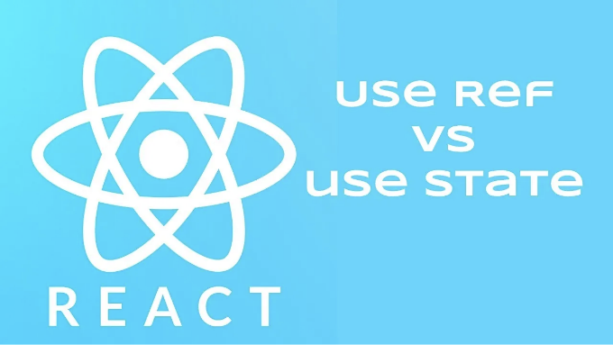

리액트는 사용자 인터페이스를 구축하는 인기있는 자바스크립트 라이브러리입니다. 개발자가 상태를 관리하고 부작용을 수행할 수 있도록 여러 후크를 제공합니다. 리액트에서 자주 사용되는 두 가지 후크는 useRef와 useState입니다. 처음에는 비슷해 보일 수 있지만, useRef와 useState는 서로 다른 목적을 가지고 있으며 각각의 사용 사례가 있습니다. 이 기사에서는 useRef와 useState를 깊게 알아보고, 그 기능을 비교하며 사용 예시를 제시하겠습니다.

# useRef 이해하기:

리액트의 useRef 후크는 컴포넌트 렌더링 간에 유지되는 변경 가능한 참조를 생성합니다. useState가 상태를 관리하고 다시 렌더링을 트리거하는 반면, useRef는 기본적으로 DOM에 액세스하고 조작하거나 다시 렌더링을 트리거하지 않는 변경 가능한 값을 저장하는 데 사용됩니다. 현재 속성이 있는 변경 가능한 객체를 반환합니다.

<!-- ui-log 수평형 -->
<ins class="adsbygoogle"
  style="display:block"
  data-ad-client="ca-pub-4877378276818686"
  data-ad-slot="9743150776"
  data-ad-format="auto"
  data-full-width-responsive="true"></ins>
<component is="script">
(adsbygoogle = window.adsbygoogle || []).push({});
</component>

예제 1: DOM 요소에 접근하기

어떤 버튼이 클릭되었을 때 입력 필드에 초점을 맞추고 싶다면 어떻게 해야 할까요. useRef를 사용하여 아래와 같이 실행할 수 있습니다:

```js
import React, { useRef } from 'react';

function MyComponent() {
  const inputRef = useRef(null);

  const handleClick = () => {
    inputRef.current.focus();
  };

  return (
    <div>
      <input ref={inputRef} />
      <button onClick={handleClick}>입력란에 초점 맞추기</button>
    </div>
  );
}
```

위의 예제에서는 useRef를 사용하여 ref를 생성하고 이를 inputRef 변수에 할당합니다. inputRef를 입력 요소의 ref 속성에 전달하여 입력 DOM 노드에 액세스할 수 있게 만듭니다. 버튼이 클릭되면 handleClick 함수가 실행되고, inputRef.current.focus()가 호출되어 입력 필드에 초점을 맞춥니다.

<!-- ui-log 수평형 -->
<ins class="adsbygoogle"
  style="display:block"
  data-ad-client="ca-pub-4877378276818686"
  data-ad-slot="9743150776"
  data-ad-format="auto"
  data-full-width-responsive="true"></ins>
<component is="script">
(adsbygoogle = window.adsbygoogle || []).push({});
</component>

# useState 이해하기:

useState 훅은 함수형 컴포넌트 내에서 상태를 관리하는 데 사용됩니다. 이를 사용하면 값을 업데이트하고 해당 값이 변경될 때 re-render를 트리거할 수 있는 변수를 생성할 수 있습니다. useState 훅은 현재 상태 값과 해당 값을 업데이트하는 함수로 이루어진 배열을 반환합니다.

예제 2: 카운터 관리

useState를 사용하여 간단한 카운터 컴포넌트를 만들어봅시다.

<!-- ui-log 수평형 -->
<ins class="adsbygoogle"
  style="display:block"
  data-ad-client="ca-pub-4877378276818686"
  data-ad-slot="9743150776"
  data-ad-format="auto"
  data-full-width-responsive="true"></ins>
<component is="script">
(adsbygoogle = window.adsbygoogle || []).push({});
</component>

```js
import React, { useState } from 'react';

function Counter() {
  const [count, setCount] = useState(0);

  const increment = () => {
    setCount(count + 1);
  };

  return (
    <div>
      <p>Count: {count}</p>
      <button onClick={increment}>Increment</button>
    </div>
  );
}
```

위 코드에서는 배열 해체 구문을 사용하여 count 상태 변수와 해당 값을 업데이트하는 setCount 함수를 할당합니다. count의 초기 값은 useState(0)를 사용하여 0으로 설정됩니다. 버튼을 클릭하면 increment 함수가 호출되어 count 상태를 1 증가시키고, 결과적으로 구성 요소가 다시 렌더링되어 count의 업데이트된 값을 반영합니다.

# useRef와 useState 비교:

useRef와 useState는 모두 값 저장에 사용될 수 있지만, 서로 다른 목적을 가지고 있습니다:```

<!-- ui-log 수평형 -->
<ins class="adsbygoogle"
  style="display:block"
  data-ad-client="ca-pub-4877378276818686"
  data-ad-slot="9743150776"
  data-ad-format="auto"
  data-full-width-responsive="true"></ins>
<component is="script">
(adsbygoogle = window.adsbygoogle || []).push({});
</component>

- 상태 관리: useState는 컴포넌트 내에서 상태를 관리하는 데 사용됩니다. 상태가 업데이트될 때 다시 렌더링을 유발하여 UI가 최신값을 반영하도록 합니다.
- DOM 접근 및 조작: useRef는 주로 DOM과 상호 작용하기 위해 사용됩니다. 입력 값을 액세스하거나 요소에 초점을 맞출 때 사용합니다. DOM 노드에 대한 참조를 저장하고 다시 렌더링을 유발하지 않고 속성을 검색할 수 있도록 합니다.
- 렌더링 간 값 보존: useRef는 컴포넌트 렌더링 간 동일한 값을 유지하며, useState는 각 렌더링마다 상태를 초기화합니다.
- 다시 렌더링 동작: useState가 반환하는 값 업데이트는 컴포넌트를 다시 렌더링합니다. 반면 useRef로 생성된 ref의 현재 속성을 업데이트하면 다시 렌더링이 트리거되지 않습니다.

# 사용 사례:

useRef와 useState의 사용 사례를 더 자세히 이해하기 위해 각각 어떤 상황에서 사용하는지 살펴봅시다:

1. useRef 사용 사례:

<!-- ui-log 수평형 -->
<ins class="adsbygoogle"
  style="display:block"
  data-ad-client="ca-pub-4877378276818686"
  data-ad-slot="9743150776"
  data-ad-format="auto"
  data-full-width-responsive="true"></ins>
<component is="script">
(adsbygoogle = window.adsbygoogle || []).push({});
</component>

1.1. DOM 요소에 액세스하는 방법: DOM 요소에 액세스하거나 조작해야 할 때, 예를 들어 입력을 초점으로 맞추거나 특정 요소로 스크롤하거나 요소의 크기를 측정해야 할 때 useRef가 적합합니다. 이를 통해 DOM 노드에 대한 참조를 만들고 해당 속성이나 메서드에 액세스할 수 있습니다.

1.2. 변경 가능한 값 저장: 렌더링 간에 지속되어야 하지만 컴포넌트의 UI에 영향을 주지 않거나 다시 렌더링을 유발하지 않는 값이 있는 경우 useRef가 좋은 선택입니다. 예를 들어 이전 값을 저장하거나 값을 캐싱하거나 변경 가능한 값을 비교할 때 useRef를 사용할 수 있습니다.

2. useState 사용 사례:

2.1. 컴포넌트 상태 관리: 컴포넌트 내에서 상태를 관리하고 업데이트해야 할 때는 useState가 권장됩니다. 컴포넌트 UI에 영향을주고 다시 렌더링을 유발하는 값을 저장하고 업데이트할 수 있는 방법을 제공합니다.

<!-- ui-log 수평형 -->
<ins class="adsbygoogle"
  style="display:block"
  data-ad-client="ca-pub-4877378276818686"
  data-ad-slot="9743150776"
  data-ad-format="auto"
  data-full-width-responsive="true"></ins>
<component is="script">
(adsbygoogle = window.adsbygoogle || []).push({});
</component>

2.2. 사용자 상호 작용 처리: 컴포넌트에 상호 작용 요소가 있는 경우 체크박스, 입력 필드 또는 토글 등, useState를 사용하여 이러한 상호 작용과 관련된 상태를 관리하는 데 일반적으로 사용됩니다. 사용자 입력에 기반하여 상태를 업데이트하고 UI에 변경 사항을 반영할 수 있습니다.

비교 예:

useRef와 useState의 차이를 더 명확하게 설명하기 위해 두 훅 모두 사용할 수 있는 예제를 살펴봅시다:

입력 필드와 제출 버튼이 있는 양식이 있다고 가정해보세요. 사용자가 제출 버튼을 클릭하면 입력 필드를 지우지 않고 성공 메시지를 표시하고자 합니다.

<!-- ui-log 수평형 -->
<ins class="adsbygoogle"
  style="display:block"
  data-ad-client="ca-pub-4877378276818686"
  data-ad-slot="9743150776"
  data-ad-format="auto"
  data-full-width-responsive="true"></ins>
<component is="script">
(adsbygoogle = window.adsbygoogle || []).push({});
</component>

```js
import React, { useRef } from 'react';

function Form() {
  const inputRef = useRef(null);

  const handleSubmit = () => {
    const value = inputRef.current.value;
    // Form 제출
    displaySuccessMessage();
  };

  const displaySuccessMessage = () => {
    // 입력 필드를 지우지 않고 성공 메시지 표시
  };

  return (
    <div>
      <input ref={inputRef} />
      <button onClick={handleSubmit}>제출</button>
    </div>
  );
}
```

<!-- ui-log 수평형 -->
<ins class="adsbygoogle"
  style="display:block"
  data-ad-client="ca-pub-4877378276818686"
  data-ad-slot="9743150776"
  data-ad-format="auto"
  data-full-width-responsive="true"></ins>
<component is="script">
(adsbygoogle = window.adsbygoogle || []).push({});
</component>

```js
import React, { useState } from 'react';

function Form() {
  const [inputValue, setInputValue] = useState('');

  const handleSubmit = () => {
    // Form 제출하기
    displaySuccessMessage();
  };

  const displaySuccessMessage = () => {
    // 성공 메시지 표시하기
    setInputValue(''); // 입력 필드 지우기
  };

  const handleInputChange = (e) => {
    setInputValue(e.target.value);
  };

  return (
    <div>
      <input value={inputValue} onChange={handleInputChange} />
      <button onClick={handleSubmit}>제출</button>
    </div>
  );
}
```

이 버전에서는 입력 필드의 상태를 관리하기 위해 useState를 사용합니다. useState('')를 사용하여 inputValue 상태를 빈 문자열로 초기화합니다. 사용자가 입력 필드에 타이핑할 때는 handleInputChange 함수가 호출되어 상태를 업데이트하고 새 값이 반영되도록 다시 렌더링이 발생합니다. 제출 버튼이 클릭될 때는 handleSubmit 함수가 실행되어 성공 메시지를 표시하고 inputValue 상태를 빈 문자열로 설정하여 입력 필드를 지우게 됩니다.

이 예제에서는 useState를 사용하여 사용자가 상호작용할 때 입력 필드의 값을 관리하고 다시 렌더링을 트리거합니다. displaySuccessMessage에서의 상태 업데이트로 입력 필드가 비워집니다.

# 결론:```

<!-- ui-log 수평형 -->
<ins class="adsbygoogle"
  style="display:block"
  data-ad-client="ca-pub-4877378276818686"
  data-ad-slot="9743150776"
  data-ad-format="auto"
  data-full-width-responsive="true"></ins>
<component is="script">
(adsbygoogle = window.adsbygoogle || []).push({});
</component>

요약하자면, useRef와 useState는 React에서 모두 필수적인 훅이지만 서로 다른 목적을 가지고 있습니다. useRef는 주로 DOM에 액세스하고 조작하거나 다시 렌더링을 유발하지 않고 가변 값을 저장하는 데 사용됩니다. 컴포넌트 렌더링 사이에 지속되는 가변 참조를 제공합니다. 반면 useState는 컴포넌트 상태를 관리하고 상태가 업데이트될 때 다시 렌더링을 유발하는 데 사용됩니다. 상태 값을 반환하고 업데이트하는 함수를 제공합니다.

useRef와 useState의 차이를 이해하고 각 훅을 언제 사용해야 하는지 파악하는 것은 효과적이고 최적화된 React 컴포넌트를 작성하는 데 중요합니다. useRef와 useState를 올바르게 활용하면 React를 사용하여 상호작용성이 높고 성능이 우수한 애플리케이션을 구축할 수 있습니다.

# 읽어주셔서 감사합니다!

이 글이 유용했기를 바랍니다. 궁금한 점이나 제안 사항이 있으면 댓글을 남겨주세요. 여러분의 피드백은 저에게 더 나아질 수 있는 기회를 제공합니다.

<!-- ui-log 수평형 -->
<ins class="adsbygoogle"
  style="display:block"
  data-ad-client="ca-pub-4877378276818686"
  data-ad-slot="9743150776"
  data-ad-format="auto"
  data-full-width-responsive="true"></ins>
<component is="script">
(adsbygoogle = window.adsbygoogle || []).push({});
</component>

Don’t forget to subscribe⭐️

Facebook Page: [https://www.facebook.com/designTechWorld1](https://www.facebook.com/designTechWorld1)

Instagram Page: [https://www.instagram.com/techd.esign/](https://www.instagram.com/techd.esign/)

Youtube Channel: [https://www.youtube.com/@tech..Design/](https://www.youtube.com/@tech..Design/)

<!-- ui-log 수평형 -->
<ins class="adsbygoogle"
  style="display:block"
  data-ad-client="ca-pub-4877378276818686"
  data-ad-slot="9743150776"
  data-ad-format="auto"
  data-full-width-responsive="true"></ins>
<component is="script">
(adsbygoogle = window.adsbygoogle || []).push({});
</component>

트위터: https://twitter.com/sumit_singh2311

사용 장비:

노트북: https://amzn.to/3yKkzaC

시계: https://amzn.to/41cialm

<!-- ui-log 수평형 -->
<ins class="adsbygoogle"
  style="display:block"
  data-ad-client="ca-pub-4877378276818686"
  data-ad-slot="9743150776"
  data-ad-format="auto"
  data-full-width-responsive="true"></ins>
<component is="script">
(adsbygoogle = window.adsbygoogle || []).push({});
</component>

React Book을 선호하시는군요: [여기](https://amzn.to/3Tw29nx)

프로그래밍 언어 관련 추가 도서 몇 권을 더 소개해드릴게요:

- [링크1](https://amzn.to/3z3tW5s)
- [링크2](https://amzn.to/40n4m6O)

<!-- ui-log 수평형 -->
<ins class="adsbygoogle"
  style="display:block"
  data-ad-client="ca-pub-4877378276818686"
  data-ad-slot="9743150776"
  data-ad-format="auto"
  data-full-width-responsive="true"></ins>
<component is="script">
(adsbygoogle = window.adsbygoogle || []).push({});
</component>

https://amzn.to/3Jzstse

https://amzn.to/3nbl8aE

**중요한 고지사항 - "Amazon 및 Amazon 로고는 Amazon.com, Inc. 또는 계열사의 상표입니다."**