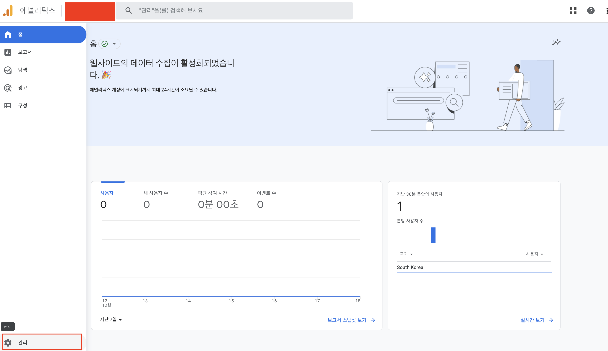
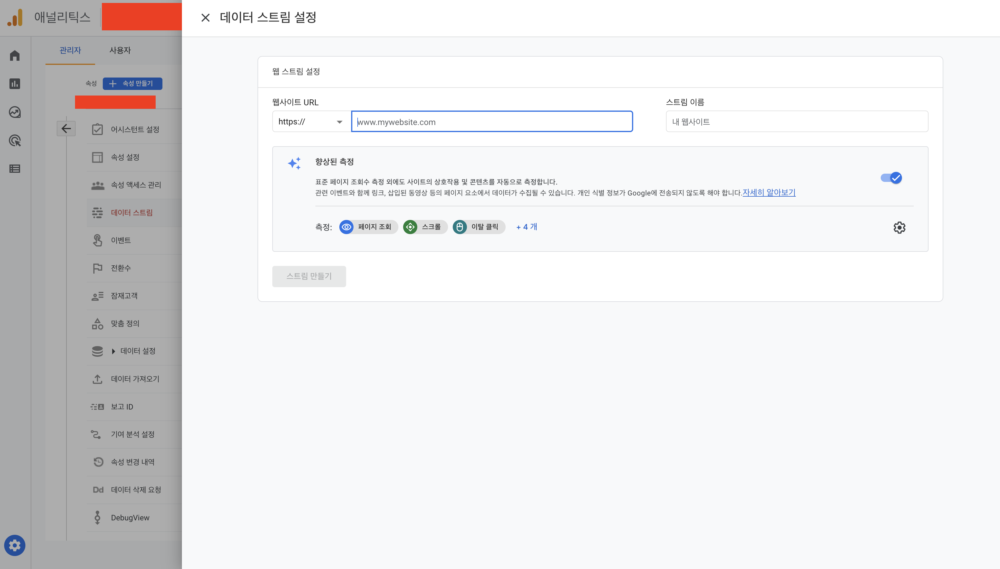

# vuepress 블로그 구글애널리틱스 적용하기

::: tip 💡이 포스팅을 읽으면
vuepress 블로그에 구글애널리틱스를 적용할 수 있습니다.
:::

구글애널리틱스를 사용하면 블로그, 쇼핑몰과 같은 사이트의 사용자에 대한 방문, 액션 데이터를 분석해주는데요.
사이트를 더 키워나가고싶은 분들이라면 구글애널리틱스를 사이트에 붙혀서 통계를 통해 마케팅에 이용하고 있습니다.

구글 애널리틱스가 **GA4 에서 GA5로 업데이트되면서 등록하는 방법이 달라졌는데요.**
달라진 내용에 대해서 정리해보도록 하겠습니다.

## 1. 설정 추가

<component is="script" src="https://pagead2.googlesyndication.com/pagead/js/adsbygoogle.js?client=ca-pub-4877378276818686" crossorigin="anonymous" async></component>

<!-- ui-log 수평형 -->

<ins class="adsbygoogle"
     style="display:block"
     data-ad-client="ca-pub-4877378276818686"
     data-ad-slot="9743150776"
     data-ad-format="auto"
     data-full-width-responsive="true"></ins>
<component is="script">
(adsbygoogle = window.adsbygoogle || []).push({});
</component>

먼저 구글 애널리틱스 사이트로 가서 설정을 추가해주어야합니다.

아래 사진의 왼쪽아래에 있는 관리 버튼을 눌러줍니다.



그 다음에 "+ 속성 만들기" 버튼을 눌러줍니다.


<component is="script" src="https://pagead2.googlesyndication.com/pagead/js/adsbygoogle.js?client=ca-pub-4877378276818686" crossorigin="anonymous" async></component>

<!-- ui-log 수평형 -->

<ins class="adsbygoogle"
     style="display:block"
     data-ad-client="ca-pub-4877378276818686"
     data-ad-slot="9743150776"
     data-ad-format="auto"
     data-full-width-responsive="true"></ins>
<component is="script">
(adsbygoogle = window.adsbygoogle || []).push({});
</component>

원하시는 속석이름과 시간대 통화를 지정해줍니다.
저는 대한민국에 통화는 달러를 선택했습니다.


카테고리와 비즈니스 규모 사용 계획을 선택해줍니다.
이 부분은 큰 의미는 없으니 저처럼 지정해주셔도 상관 없습니다.


## 2. 사이트 적용

속성을 만들었다면 사이트를 적용해야하는데요. 아래 화면에서 웹을 눌러줍니다.


원하시는 vuepress 블로그 주소를 넣어주시면 됩니다.
사실 vuepress 주소가 아닌 어떤 주소를 넣어주셔도 상관 없습니다.



사이트를 적용하고 나면 아래에서 "태그 안내 보기" 버튼을 클릭해줍니다.


거기서 직접 설치 탭을 선택해주시면아래와 같은 코드가 나오는데요. 이 코드를 vuepress 블로그 저장소 설정에 넣어주어야합니다.


<component is="script" src="https://pagead2.googlesyndication.com/pagead/js/adsbygoogle.js?client=ca-pub-4877378276818686" crossorigin="anonymous" async></component>

<!-- ui-log 수평형 -->

<ins class="adsbygoogle"
     style="display:block"
     data-ad-client="ca-pub-4877378276818686"
     data-ad-slot="9743150776"
     data-ad-format="auto"
     data-full-width-responsive="true"></ins>
<component is="script">
(adsbygoogle = window.adsbygoogle || []).push({});
</component>

## 3. vuepress 설정

vuepress 블로그의 head에 script는 아래와 같이 적용하고 있기 때문에 **위 사진에서 src값과 script 사이에 있는 html을 각각 넣어주시면 됩니다.**

```ts
export default defineUserConfig({
  title: "ui-log",
  description: "Today I leanred",
  head: [
    ["script", { async: true, src: "src값" }],
    ["script", {}, ` script태그 사이에 있는 html`],
  ],
});
```

위와 같이 작성하고 블로그를 배포하게 되면 아래처럼 구글 애널리틱스 분석을 확인할 수 있습니다.


