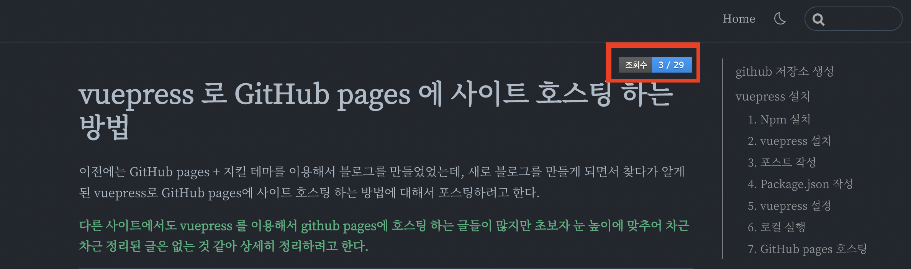
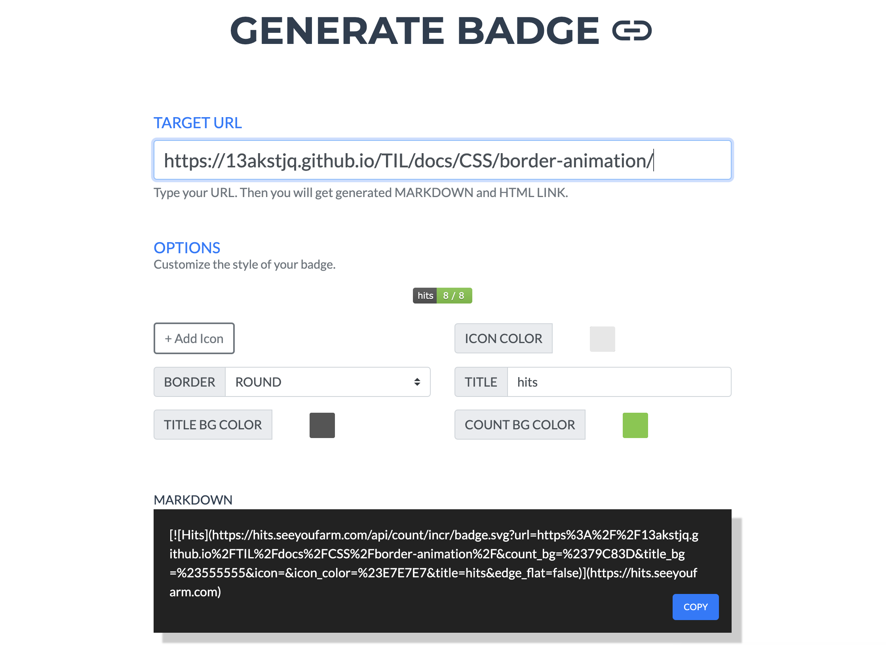
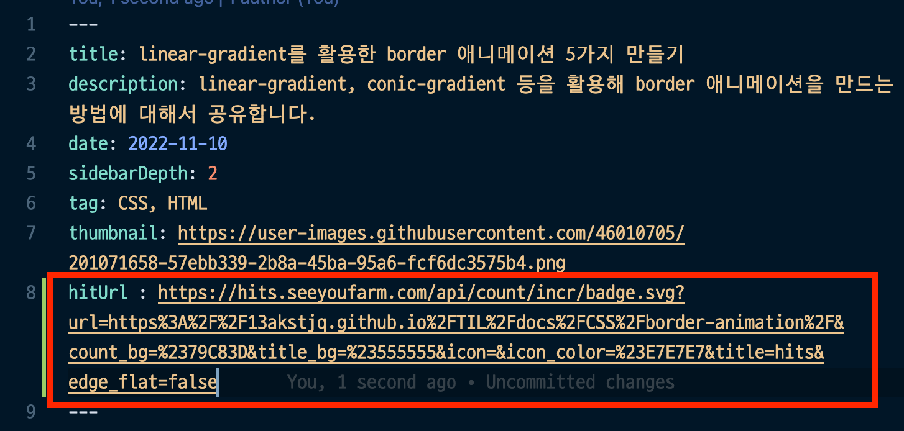

# hits를 이용해 블로그 조회수 기능 추가하는 방법

::: tip 목표

hits seeyoufarm을 이용해 블로그에 아래와 같은 조회수를 추가할 수 있다.

:::

<component is="script" src="https://pagead2.googlesyndication.com/pagead/js/adsbygoogle.js?client=ca-pub-4877378276818686" crossorigin="anonymous" async></component>

<!-- ui-log 수평형 -->

<ins class="adsbygoogle"
     style="display:block"
     data-ad-client="ca-pub-4877378276818686"
     data-ad-slot="9743150776"
     data-ad-format="auto"
     data-full-width-responsive="true"></ins>
<component is="script">
(adsbygoogle = window.adsbygoogle || []).push({});
</component>

티스토리, 네이버 블로그와 같은 플랫폼 블로그를 사용하는 것이 아닌
vuepress 같은 정적 사이트로 블로그를 운영하면 조회수 기능이 따로 내장되어있지 않습니다.

[hits](https://hits.seeyoufarm.com/) 사이트로 가줍니다.

위의 TARGET URL에 블로그 포스팅 주소를 넣어주면 MARKDOWN 란에 주소가 생깁니다.
이걸 포스팅에 넣어서 사용하시면 됩니다.

저 같은 경우는 vuepress를 사용하기 때문에 아래 사진처럼 hitUrl 란에 넣어주어 사용하고 있습니다.

